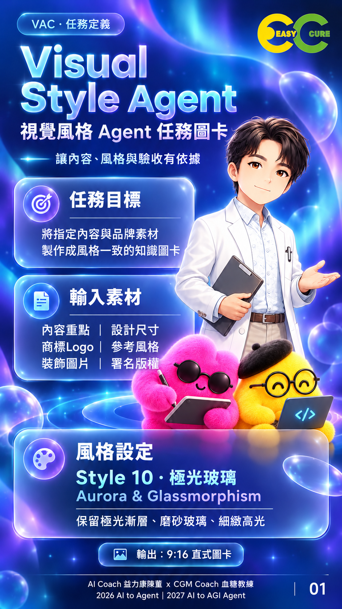
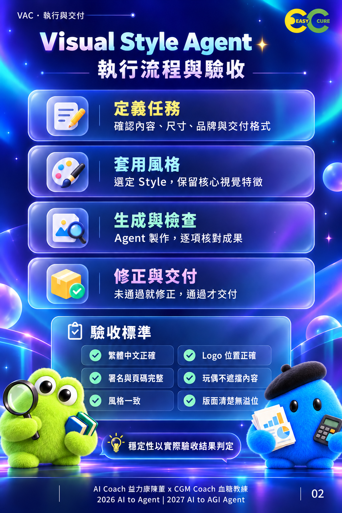
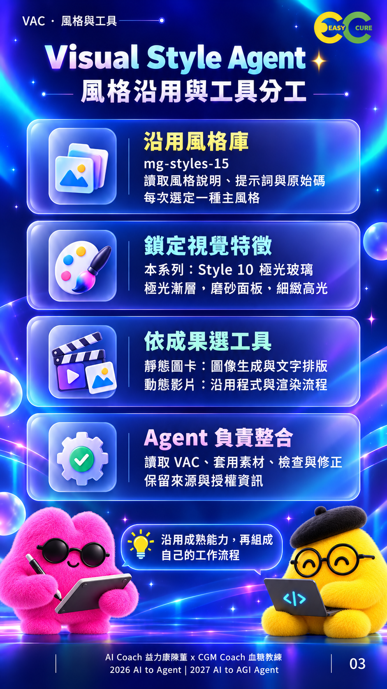
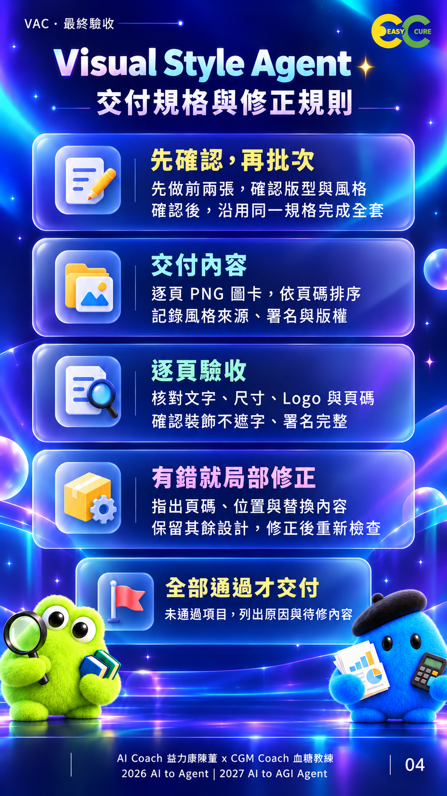

# Visual Style Agent｜視覺設計代理 VSA

以 VAC 定義任務，沿用風格規格，讓 Agent 依據檢查結果修正與交付視覺內容。

Repo：`ai-to-agent-visual-style-agent` · 版本：0.1.0 · 日期：2026-10-07

## 為什麼需要 VSA

適合需要成套知識圖卡的講師、內容創作者與企業團隊。把內容、風格與驗收分開說清楚，降低反覆猜測需求的機會。改善幅度尚未經比較實驗驗證。

## 範圍與狀態

本專案是方法論、任務規格與視覺教材；不是可安裝 Skill、獨立 Agent 軟體或自動渲染服務。本版提供四張 PNG、說明、VAC 範本、示範與驗收表。未提供動態影片或十五種風格的程式實作。

**發布狀態：公開 repo，授權為保留所有權利（All rights reserved）；已建立 tag v0.1.0，尚未建立 GitHub Release。**

## 如何運作

定義任務 → 套用風格 → 生成與檢查 → 修正與交付。

六項輸入：內容重點、設計尺寸、商標Logo、參考風格、裝飾圖片、署名版權。

輸出：依頁碼排序的圖卡、來源紀錄、驗收結果。逐頁核對文字、尺寸、Logo、署名、頁碼、風格與遮擋問題。

## 快速開始

1. 閱讀 [使用方式](docs/usage.md)，不需安裝本專案。
2. 複製 [VAC 範本](templates/vac-task.md)，填入六項素材與交付條件。
3. 將範本與自己的素材交給具備圖像製作能力的 Agent；工具費用與權限依平台而定。
4. 先生成兩張並確認設計，再完成整套。
5. 使用 [驗收表](templates/acceptance.md) 記錄問題與修正結果。

完整填寫示範見 [課程圖卡案例](examples/course-cards.md)。此例為教學示範，不代表自動化端到端測試通過。

## 圖卡

| 頁碼 | 主題 |
|---|---|
| 01 | 任務定義與六項素材 |
| 02 | 執行流程與驗收 |
| 03 | 風格沿用與工具分工 |
| 04 | 交付規格與修正規則 |

## 文件索引

- [方法定義](docs/methodology.md)
- [使用方式](docs/usage.md)
- [風格來源](docs/style-source.md)
- [社群文章](docs/social-post.md)
- [發布檢查](docs/validation.md)
- [圖片尺寸與雜湊](assets/cards/manifest.json)
- [版本紀錄](CHANGELOG.md)、[貢獻指南](CONTRIBUTING.md)、[發布說明](RELEASE_NOTES.md)
- [GitHub 設定](docs/github-settings.md)、[素材歸屬](CREDITS.md)、[授權狀態](LICENSE)

## 限制與後續

圖卡保留原始生成尺寸：第 02 張為 2:3，其餘接近 9:16；本版不是統一 1080×1920 的交付。見驗收紀錄。需要精確比例時必須另行重排並核對，不能把文字拉伸當作驗收通過。

後續可處理統一尺寸、可安裝 Skill 與量化成功率測試；這些均非本版已完成功能。不適合要求精確印刷出血或完全無人工審核的用途。

## 授權與作者

本 repo 採保留所有權利（All rights reserved），見 LICENSE，法律權利人為 AI Coach 益力康陳董。請勿將上游 MIT 授權套用到本專案全部內容。Logo、人物與裝飾圖片未授予獨立再使用權利。詳見 LICENSE 及 CREDITS.md。

AI Coach 益力康陳董 x CGM Coach 血糖教練 | 2026 AI to Agent | 2027 AI to AGI Agent
